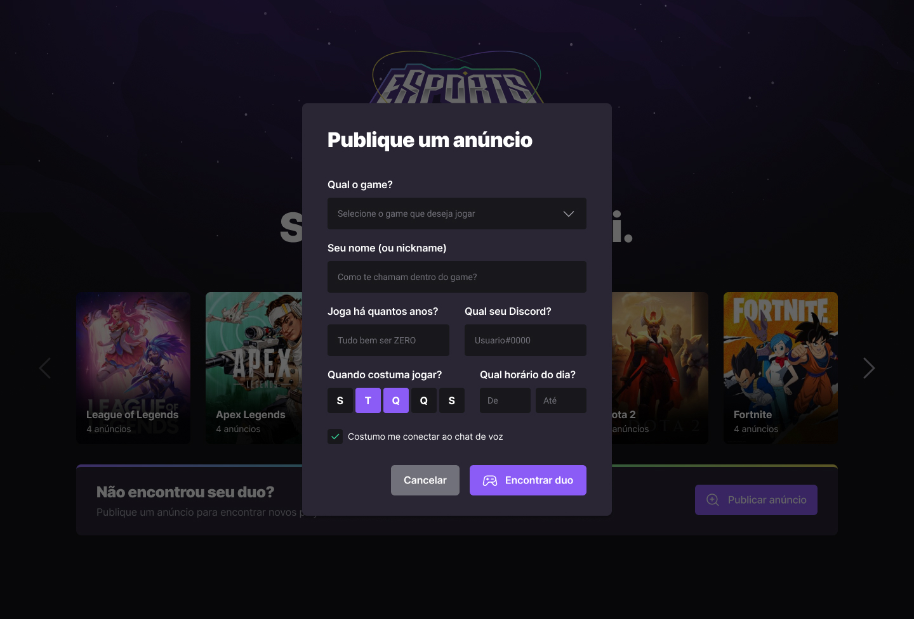
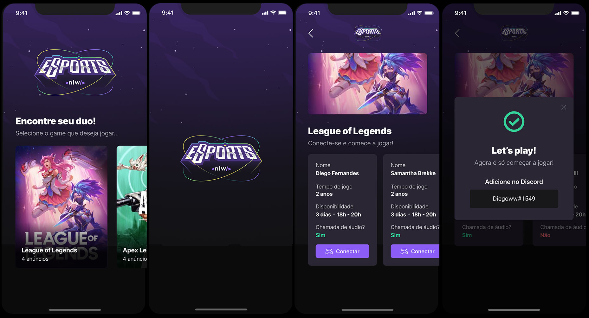

<h1 align="center">
    
</h1>

## Landing Page
  
  
## Create Ad Screen
  
  
## Mobile
  

## :rocket: Tech Stack

This project was developed with the following technologies:

- [Javascript](https://developer.mozilla.org/pt-BR/docs/Web/JavaScript)
- [Typescript](https://www.typescriptlang.org/)
- [Node.js](https://nodejs.org/en/)
- [ReactJs](https://reactjs.org)
- [ReactNative](https://reactnative.dev)
- [Tailwindcss](https://tailwindcss.com/)
- [Radix UI](https://www.radix-ui.com/)
- [Phosphoricons](https://phosphoricons.com/)
- [Prisma ORM](https://www.prisma.io//)
- [Vite](https://vitejs.dev/)
- [Expo](https://expo.dev/)